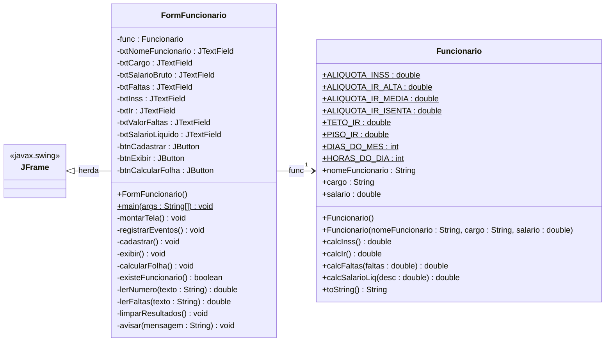
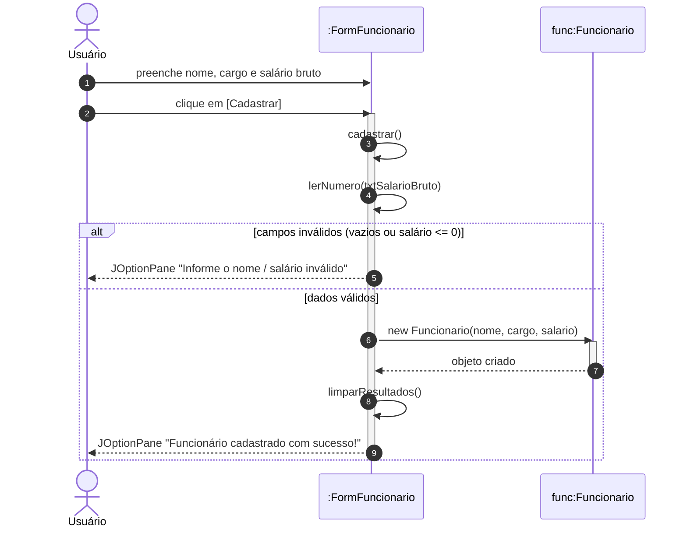
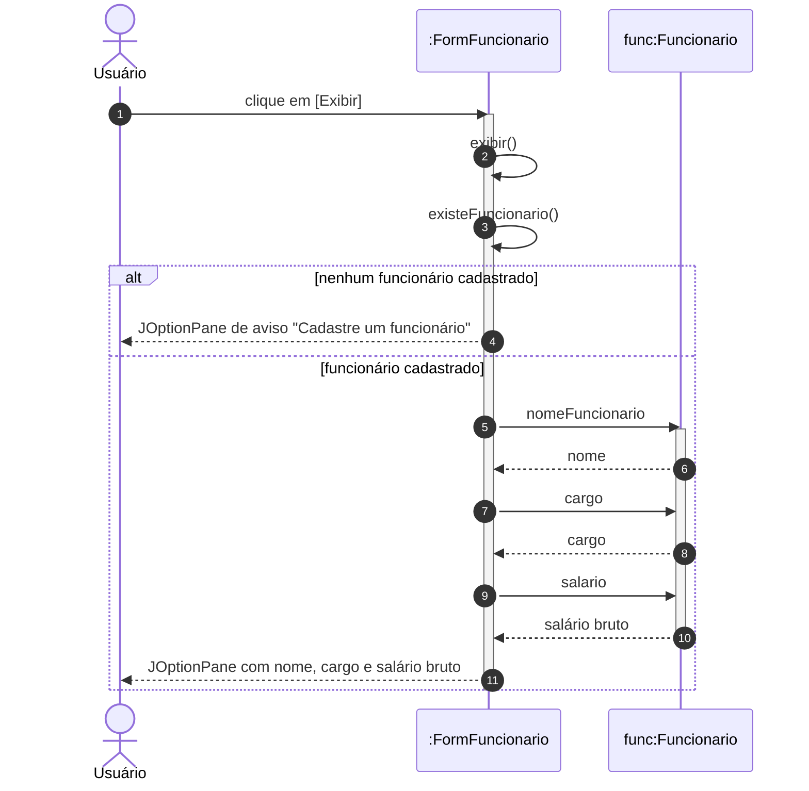
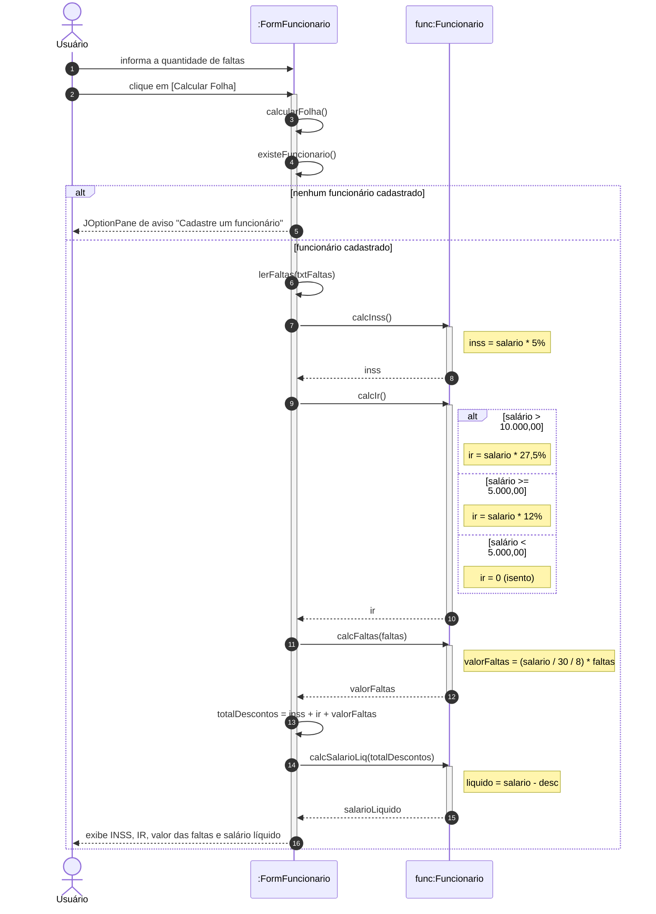
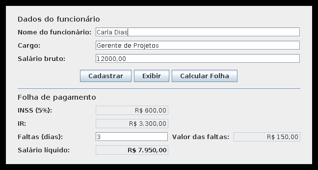
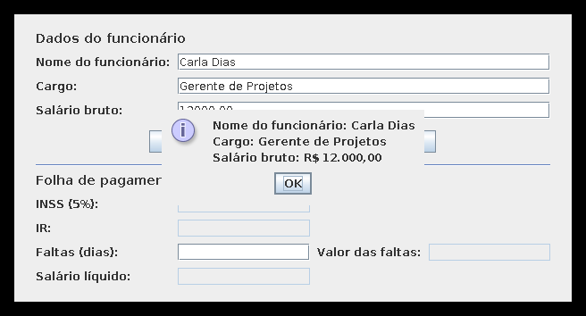

# Projeto Salário Interface — Cálculo do Salário Líquido

Atividade Prática de Desenvolvimento — **UMC**
Entregáveis do enunciado: **Diagrama de Classes**, **Diagramas de Sequência** e **Codificação completa**.

Aplicação **Java + Swing** que cadastra um funcionário (nome, cargo e salário bruto), exibe os
dados cadastrados e calcula a folha de pagamento com os descontos de **INSS**, **Imposto de Renda**
e **faltas**, apresentando o **salário líquido**.

---

## 1. Estudo de caso (enunciado)

> Um projeto deve possuir uma interface que calcule o salário líquido de um funcionário. Deverão ser
> cadastrados com opção de exibição os dados do funcionário: Nome do funcionário, cargo, salário bruto.
> Para cálculo e exibição do salário líquido os seguintes descontos deverão existir e devem ser exibidos na tela:
>
> 1. **Desconto do INSS:** 5% do salário.
> 2. **Desconto do IR:** se o salário bruto for acima de 10.000,00 → 27,5%; inferior a 10.000 e maior ou igual a 5000 → 12%; se inferior a 5000 → 0%.
> 3. **Faltas:** caso existam faltas, deverá aparecer o valor correspondente aos dias da falta: quanto o funcionário recebe por dia (salário bruto/30/8) multiplicados pelas faltas.
>
> **Obs:** Para cada cálculo métodos específicos deverão existir na classe correspondente.

---

## 2. Regras de cálculo implementadas

| # | Desconto | Método | Fórmula |
|---|----------|--------|---------|
| 1 | INSS | `calcInss()` | `salario × 0,05` |
| 2 | Imposto de Renda | `calcIr()` | `salario > 10.000` → `× 0,275`<br>`5.000 ≤ salario ≤ 10.000` → `× 0,12`<br>`salario < 5.000` → `× 0` (isento) |
| 3 | Faltas | `calcFaltas(faltas)` | `(salario ÷ 30 ÷ 8) × faltas` |
| — | Salário líquido | `calcSalarioLiq(desc)` | `salario − (INSS + IR + faltas)` |

Cada cálculo tem o seu **método específico dentro da classe `Funcionario`**, exatamente como pede a
observação do enunciado. A tela (`FormFuncionario`) não faz conta nenhuma: ela apenas lê os campos,
chama os métodos do objeto `Funcionario` e mostra os resultados formatados em Real (R$).

---

## 3. Estrutura do projeto

```
ProjetoSalarioInterface/
├── src/
│   ├── Funcionario.java        # Modelo + regras de cálculo (INSS, IR, faltas, líquido)
│   └── FormFuncionario.java    # Interface gráfica Swing + método main()
├── teste/
│   └── TesteFuncionario.java   # 30 testes das regras de cálculo (sem JUnit)
├── docs/                       # Diagramas UML (Mermaid .mmd e PlantUML .puml)
│   ├── diagrama-de-classes.mmd / .puml
│   ├── sequencia-cadastrar.mmd / .puml
│   ├── sequencia-exibir.mmd / .puml
│   └── sequencia-calcular-folha.mmd / .puml
├── imagens/                    # Telas da aplicação e diagramas UML renderizados (PNG)
├── executar.sh                 # Compila e executa no Linux/macOS
├── executar.bat                # Compila e executa no Windows
└── README.md
```

---

## 4. Diagrama de Classes

Fontes: [`docs/diagrama-de-classes.mmd`](docs/diagrama-de-classes.mmd) (Mermaid) · [`docs/diagrama-de-classes.puml`](docs/diagrama-de-classes.puml) (PlantUML)
Imagem pronta para o relatório: [`imagens/diagrama-de-classes.png`](imagens/diagrama-de-classes.png)



---

## 5. Diagramas de Sequência

### 5.1 Cadastrar funcionário

Fontes: [`docs/sequencia-cadastrar.mmd`](docs/sequencia-cadastrar.mmd) · [`docs/sequencia-cadastrar.puml`](docs/sequencia-cadastrar.puml) — imagem: [`imagens/sequencia-cadastrar.png`](imagens/sequencia-cadastrar.png)



### 5.2 Exibir dados do funcionário

Fontes: [`docs/sequencia-exibir.mmd`](docs/sequencia-exibir.mmd) · [`docs/sequencia-exibir.puml`](docs/sequencia-exibir.puml) — imagem: [`imagens/sequencia-exibir.png`](imagens/sequencia-exibir.png)



### 5.3 Calcular folha (salário líquido)

Fontes: [`docs/sequencia-calcular-folha.mmd`](docs/sequencia-calcular-folha.mmd) · [`docs/sequencia-calcular-folha.puml`](docs/sequencia-calcular-folha.puml) — imagem: [`imagens/sequencia-calcular-folha.png`](imagens/sequencia-calcular-folha.png)



---

## 6. A interface

Tela principal com a folha calculada (Carla Dias, Gerente de Projetos, R$ 12.000,00 e 3 faltas):



Botão **Exibir** — opção de exibição dos dados cadastrados:



---

## 7. Como compilar e executar

### Pelo terminal (Linux / macOS)

```bash
cd ProjetoSalarioInterface
./executar.sh
```

### Pelo terminal (Windows)

```bat
cd ProjetoSalarioInterface
executar.bat
```

### Manualmente (qualquer sistema)

```bash
javac -encoding UTF-8 -d build src/Funcionario.java src/FormFuncionario.java
java -cp build FormFuncionario
```

> O parâmetro `-encoding UTF-8` garante que os acentos das mensagens da tela apareçam corretamente.

### Pela IDE (NetBeans / IntelliJ / Eclipse)

1. Crie um projeto Java comum (sem framework).
2. Copie `src/Funcionario.java` e `src/FormFuncionario.java` para o pacote padrão (*default package*).
3. Execute a classe `FormFuncionario` (é ela que possui o `main`).

---

## 8. Testes das regras de cálculo

A classe `teste/TesteFuncionario.java` confere as três regras do enunciado sem precisar de
nenhuma biblioteca externa:

```bash
javac -encoding UTF-8 -d build src/Funcionario.java teste/TesteFuncionario.java
java -cp build TesteFuncionario
```

Saída esperada: `Testes executados: 30 / Falhas: 0 / RESULTADO: TODOS OS TESTES PASSARAM`.

Conferência manual dos cenários usados no teste:

| Funcionário | Salário bruto | Faltas | INSS (5%) | IR | Valor das faltas | Salário líquido |
|---|---|---|---|---|---|---|
| Ana Souza (Assistente) | R$ 3.000,00 | 2 | R$ 150,00 | R$ 0,00 (isento) | R$ 25,00 | **R$ 2.825,00** |
| Bruno Lima (Analista) | R$ 8.000,00 | 0 | R$ 400,00 | R$ 960,00 (12%) | R$ 0,00 | **R$ 6.640,00** |
| Carla Dias (Gerente) | R$ 12.000,00 | 3 | R$ 600,00 | R$ 3.300,00 (27,5%) | R$ 150,00 | **R$ 7.950,00** |

---

## 9. Como gerar/editar os diagramas

Os diagramas estão em dois formatos, os dois abrindo sem instalar nada:

| Formato | Arquivo | Onde abrir |
|---|---|---|
| Mermaid | `docs/*.mmd` | [mermaid.live](https://mermaid.live) — cole o conteúdo e exporte em PNG/SVG. Também é renderizado direto neste README pelo GitHub. |
| PlantUML | `docs/*.puml` | [plantuml.com/plantuml](https://www.plantuml.com/plantuml) ou o plugin PlantUML do VS Code / IntelliJ / Astah. |

As imagens já renderizadas ficam na pasta [`imagens/`](imagens) e podem ser coladas
diretamente no documento Word da entrega.

---

## 10. Decisões de projeto

- **Salário bruto exatamente igual a R$ 10.000,00.** O enunciado diz "acima de 10.000,00 → 27,5%" e
  "inferior a 10.000 e maior ou igual a 5000 → 12%", ou seja, o valor exato de 10.000,00 não é citado
  em nenhuma das duas faixas. Como 10.000,00 **não é "acima de" 10.000,00**, o projeto aplica a faixa
  de **12%** (`salario > 10000` → 27,5%; `salario >= 5000` → 12%).
- **Fórmula das faltas.** O enunciado descreve o valor como "quanto o funcionário recebe por dia" e
  logo em seguida fornece a fórmula `salário bruto/30/8`. A fórmula foi implementada **exatamente como
  escrita no enunciado** (dividir por 30 dias e por 8 horas). Vale observar que essa divisão resulta no
  valor da **hora** trabalhada; se o professor quiser o valor do **dia**, basta remover a divisão por 8
  na constante `HORAS_DO_DIA` do método `calcFaltas`.
- **Atributos públicos em `Funcionario`.** Mantidos como `+` (público) para ficar fiel ao diagrama de
  classes passado em sala. Em um projeto real seriam `private` com *getters* e *setters*.
- **Faltas negativas** não geram desconto (`calcFaltas` retorna 0), e o campo de faltas em branco é
  tratado como zero falta.
- **Separação de responsabilidades.** Toda regra de negócio está em `Funcionario`; a classe
  `FormFuncionario` cuida apenas da interface. É isso que permite testar os cálculos sem abrir a tela.
